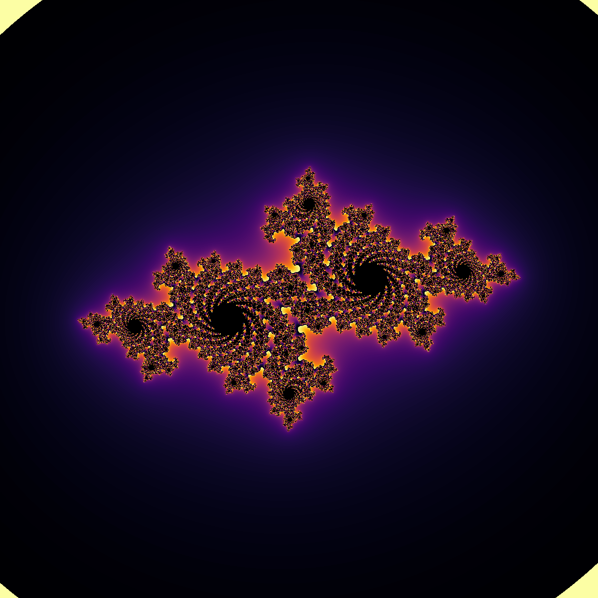

# Fractal Explorer

[](https://github.com/sallerk/fractal-explorer/actions/workflows/ci.yml)

Real-time GUI fractal explorer (Julia, Mandelbrot, Burning Ship, Tricorn, Newton) with
live color mapping, GPU acceleration (CUDA via CuPy), and image export.



## Setup

```bash
python -m venv .venv
.venv\Scripts\pip install -r requirements.txt
```

GPU acceleration requires an NVIDIA GPU; if `cupy` isn't installed or no GPU is found,
the app falls back to CPU automatically.

## Run

```bash
run.bat
```

or directly:

```bash
.venv\Scripts\python.exe fractal_explorer.py
```

## Controls

- **Mode**: Julia / Mandelbrot
- **Formula**: Standard, Burning Ship, Tricorn, Newton
- **Re(c) / Im(c)**: the complex constant driving the fractal
- **Exponent n**, **Max iterations**: detail/complexity controls
- Mouse wheel: zoom in/out toward the cursor
- Click-drag: pan (Julia/Burning Ship/Tricorn modes)
- Click on the Mandelbrot view: jump to the Julia set for that point
- **Save image...**: export a high-resolution PNG/JPEG
- **F11**: toggle fullscreen
